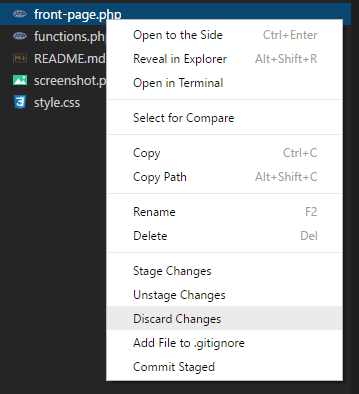

# rightclick-git README

Stop having to go into the SCM tab for goodness sakes.

## Features

It does this and not much else:

I think that's pretty nifty though.

## Requirements

* Git

## Known Issues

- To be found out

## Release Notes

### 1.0.0

Initial release
